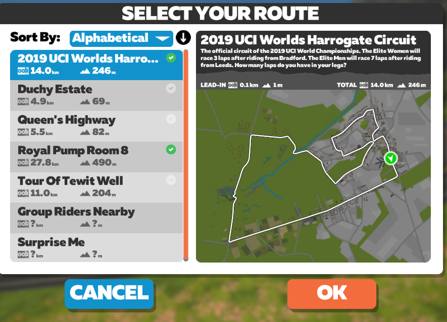

# Jazda dowolna 

Jazda dowolna to tzw. _free ride_. Opcję tę wybiera się z ekranu startowego.

Na górze ekranu znajdują się trzy światy dostępne w danym dniu na Zwifcie zgodnie z [kalendarzem](https://zwiftinsider.com/schedule). Należy wybrać jeden z nich (_World choice_), a następnie przejść do listy tras (_routes_).  

{:height="400px" width="600px"}   
*Lista tras*  

Po wybraniu jednej z tras kliknij _Ride_ na dole ekranu. Wówczas przeniesiesz się do wirtualnego świata, gdzie możesz jeździć we własnym tempie z innymi kolarzami, którzy są w danym czasie online.

Jest to opcja polecana na początek przygody ze Zwiftem. W tym trybie nie działa ERG.

Sama jazda to nie wszystko, co oferuje Zwift. W ramach jazdy można również:

* poprawiać własne czasy na segmentach (KOM, sprint, loop)
* zdobywać koszulki (dla najlepszego górala, sprintera itp.)
* korzystać z [PowerUp’ów](https://zwiftinsider.com/powerups)
* zmieniać kierunek jazdy czy trasę
* robić zdjęcia i je dodawać na Stravę
* pisać komentarze do innych użytkowników na trasie czy dawać im like’i, tzw. _Ride-On_ (przydatny _Zwift Companion_)
* dołączać do innych użytkowników na trasie. W tym celu kliknij na nazwę użytkownika wyświetlającego się po prawej stronie trasy, a następnie na _Join_. 