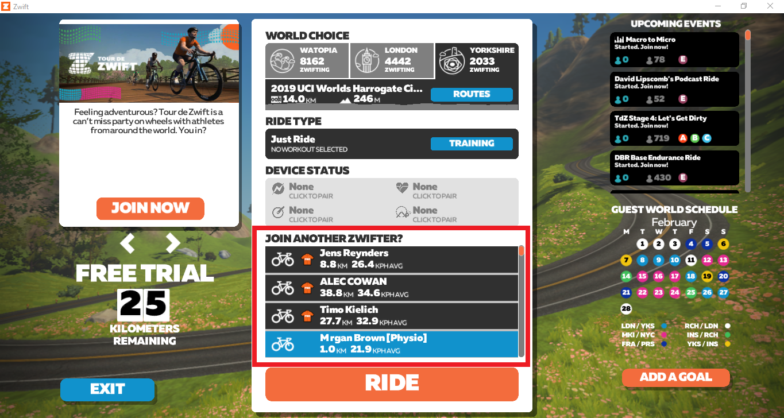

# Jazda z Pace Partnerem

Ciekawą opcją jest również możliwość dołączenia do konkretnego użytkownika aktualnie znajdującego się na trasie. 

Istnieją 2 opcje:
* jazda z tzw. Pace Partnerem, czyli botem. Aktualnie jest 4 takich awatarów reprezentujących daną kategorię. Jeżdzą oni po trasach, które zmieniają się co tydzień.

{:height="300px" width="500px"}   
*Pace Partnerzy*  

* jazda z innym użytkownikiem Zwifta

W tym celu na ekranie startowym należy wybrać odpowiedniego użytkownika w sekcji _Join another Zwifter?_.

{:height="300px" width="500px"}   
*Wybór Pace Partnera lub użytkownika na ekranie startowym*  

Jest to jazda grupowa, ale w stałym tempie, które można dostosować pod siebie, wybierając osobę o odpowiedniej dla nas średniej prędkości. Można z niej skorzystać podczas rozgrzewki, gdy chcesz jechać dłuższy dystans lub ze stałym tempem. A może chcesz poćwiczyć drafting lub potrenować interwały? Zawsze raźniej jest z kimś niż samemu.
         