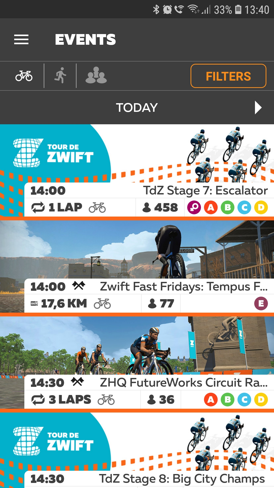
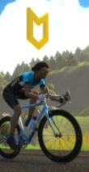
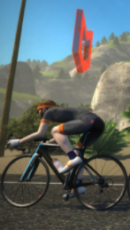

# Jazda grupowa  

Jazda grupowa to tzw. _group ride_. Opcję tę wybiera się w aplikacji _Zwift Companion_ lub na Zwifcie (_Upcoming events_) bezpośrednio w aplikacji lub na [stronie z wydarzeniami](https://www.zwift.com/eu/events).

{:height="500px" width="150px"}  
*Wyścigi w aplikacji Zwift Companion*  

Jest to jednak coś innego niż jazda samemu czy trening. Dzięki Zwiftowi poczujesz się niemal jak na prawdziwej ustawce. 

Podobnie jak w przypadku wyścigów tu również obowiązują kategorie i warto wcześniej zaplanować sobie rozgrzewkę.

Jednak w przeciwieństwie do wyścigu celem jazdy grupowej jest korzystanie z dobrodziejstw jazdy w peletonie i draftingu. Mocniejsi kolarze będą jechać z przodu a słabsi z tyłu stawki.

W jeździe grupowej na początku peletonu jedzie lider, nad którym wyświetla się żółta strzałka. Z kolei w ogonie mamy tzw. sweepera z czerwoną strzałką, który pilnuje, by nikt nie odłączył się od peletonu.

{:height="300px" width="100px"} {:height="400px" width="100px"}    
*Lider i Sweeper*                                      

**Kilka dobrych rad:**
* nie wyprzedzaj lidera
* trzymaj się jak najbliżej lidera lub z przodu peletonu
* korzystaj z draftingu z umiarem; pozwól tym mocnym odpocząć ci na kole
* współpracuj z innymi
* baw się dobrze!

