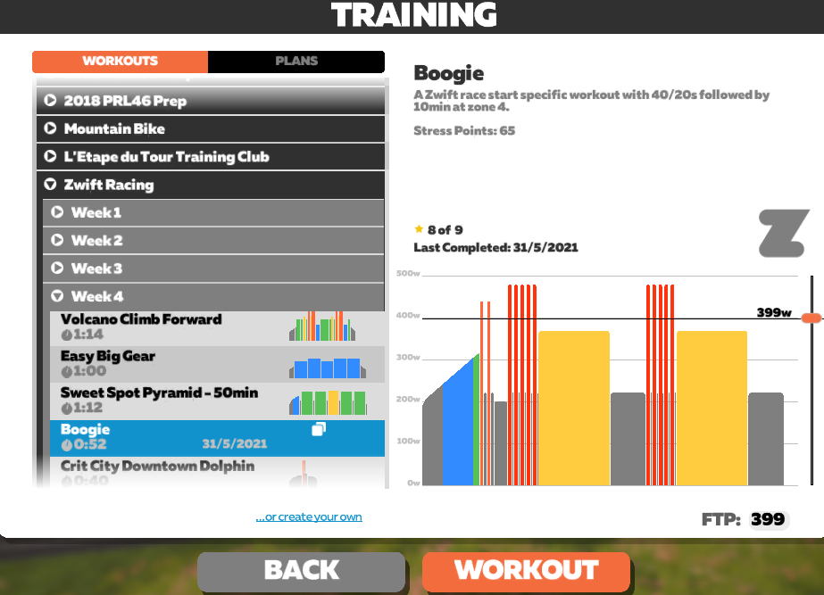
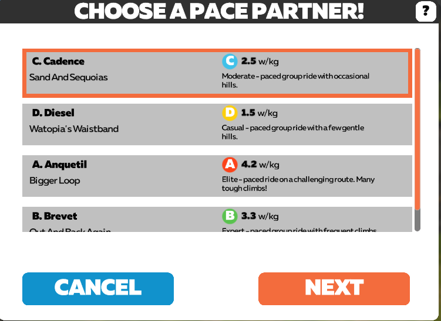
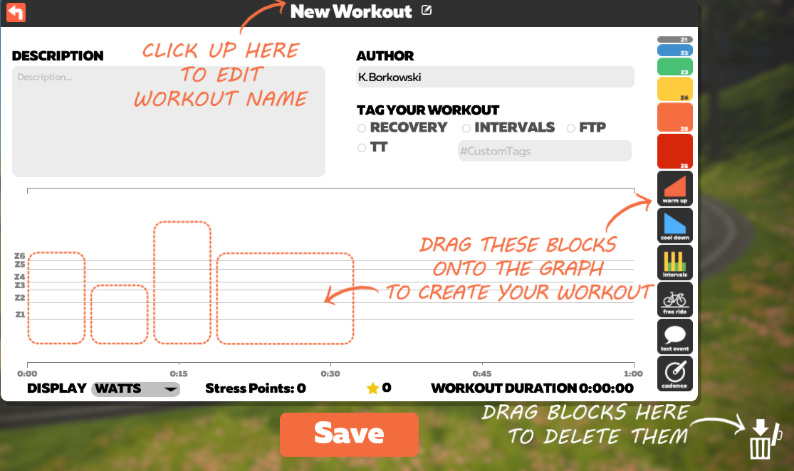

# Treningi 

Na Zwifcie można wybierać spośród różnego rodzaju treningów (_training_). W tym celu kliknij _Training_ w opcji _Ride type_.

{:height="400px" width="600px"}  
*Treningi*  

Na tym ekranie możesz wybrać odpowiedni dla siebie trening indywidualny:
* _workout_ - trening jednostkowy, lub
* _plan treningowy_ - ustrukturyzowany zestaw treningów do wykonywania przez określony czas i w konkretnym celu (np. poprawa mocy, przygotowanie do wyścigów).

{:height="400px" width="600px"}  
*Plan* 

Możesz również stworzyć **własny trening**. W tym celu wybierz _Custom Workouts_ i kliknij _Create a new workout_.

{:height="400px" width="600px"}  
*Stwórz własny trening*  

Trenować możesz również w formie [jazdy grupowej]({% link /../jazdy-grupowe.md). 

