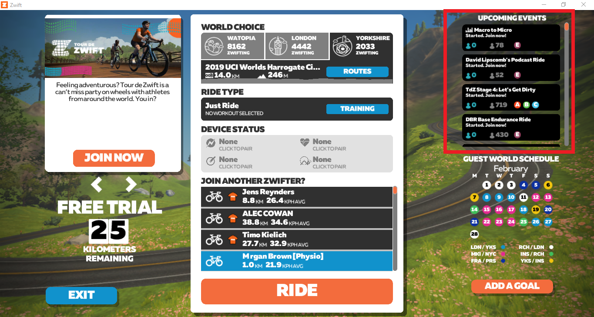
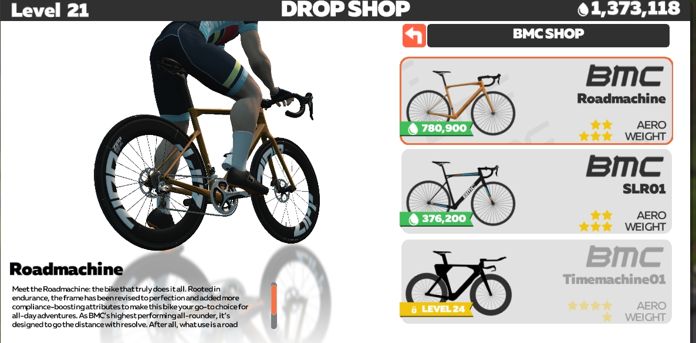

# Wyścigi 

Wyścigi (_races_) na Zwifcie to jest to, co kolarze lubią najbardziej. Od niedawna w tym wirtualnym świecie odbywają się nawet [Mistrzostwa Świata](https://velonews.pl/posts/7017-zwift-ponownie-gospodarzem-mistrzostw-swiata-uci-cycling-esports-world-championships), co pokazuje, jak bardzo e-sport zyskuje na znaczeniu. Niestety Zwift wciaż walczy z plagą oszustw poprzez wpisywanie przez zawodników zaniżonych parametrów tj. wzrost czy waga, co pozwala im uzyskiwać lepsze wyniki. Dlatego też warto traktować to przede wszystkim jako dobrą zabawę.

Na Zwifcie możesz wziąć udział w wyścigach:

* szosowych 
* czasowych (_time trial - TT_)   

Wyścigi dzielą się również na 2 grupy:
* publiczne
* na zaproszenie

Wyboru wyścigu dokonujesz w aplikacji _Zwift Companion_ lub bezpośrednio na Zwifcie (_Upcoming events_). Możesz też podejrzeć listę wyścigów na [stronie z wydarzeniami](https://www.zwift.com/eu/events). 

{:height="600px" width="200px"}  
*Jazdy grupowe i wyścigi w aplikacji Zwift Companion*

{:height="300px" width="500px"}  
*Jazdy grupowe i wyścigi na ekranie startowym Zwifta*  

Uwaga: należy wybrać wyścig zgodnie z własną [kategorią]({% link /../../Glosariusz.md). W przeciwnym razie grozi dyskwalifikacja!

**Dobre rady:**
* Sprawdź trasę przed wyścigiem. Zwróć szczególną uwagę na wzniesienia, liczbę okrążeń i długość trasy.
* Wybierz odpowiedni do trasy rower i koła z garażu (jeśli już osiągnąłeś odpowiedni poziom lub zdobyłeś wymaganą liczbę kropelek (_drops_), by móc je wymienić na lepszy sprzęt). Więcej na ten temat znajdziesz na stronie [Zwift Insider](https://support.zwift.com/en_us/drop-shop-faq-Bk1vMkTfB).

{:height="300px" width="500px"}  
*Zakupy w Drop Shop* 

* Oczekuj ognia od startu (w przypadku wyścigów TT - do mety)!
* Korzystaj z draftingu (patrz [Glosariusz]({% link /../../Glosariusz.md)) i [PowerUp’ów](https://zwiftinsider.com/powerups), by oszczędzać siły (nie dotyczy wyścigów TT).
* Trzymaj się środka peletonu. Na przodzie za bardzo się zmęczysz, a gdy będziesz z tyłu, mocniejsi moga ci odjechać podczas ataku i tego nie zauważysz.
* Skonfiguruj konto na [ZwiftPower](https://zwiftpower.com), by podejrzeć dokładne wyniki, nie tylko swoje, ale również swoich rywali.
