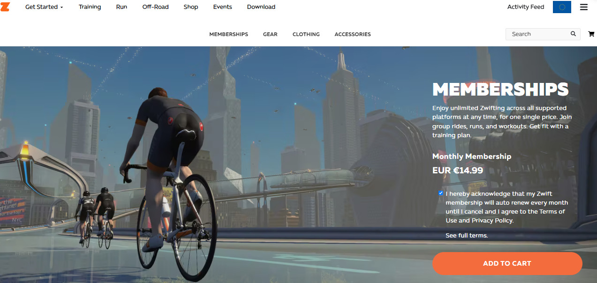

# Jak subskrybować? 

1. Zaloguj się do swojego konta na [Zwifcie](https://www.zwift.com/) w przeglądarce.
   
2. Wybierz zakładkę _Shop_, a następnie _Memberships_.
    {:height="250px" width="400px"}   
*Proces zakupu - krok 1*
   
3. Potwierdź akceptację Warunków (_Terms_) oraz kliknij _Add to Cart_.
    {:height="250px" width="400px"}   
*Proces zakupu - krok 2*
   
4. Sprawdź, czy wszystko się zgadza z zamówieniem i kliknij _Checkout now_ a na następnym oknie _Secure Checkout_.

5. W kolejnym kroku musisz podać dane karty płatniczej, z której **co miesiąc** będą pobierane płatności.
    {:height="250px" width="400px"}   
*Dane do płatności*